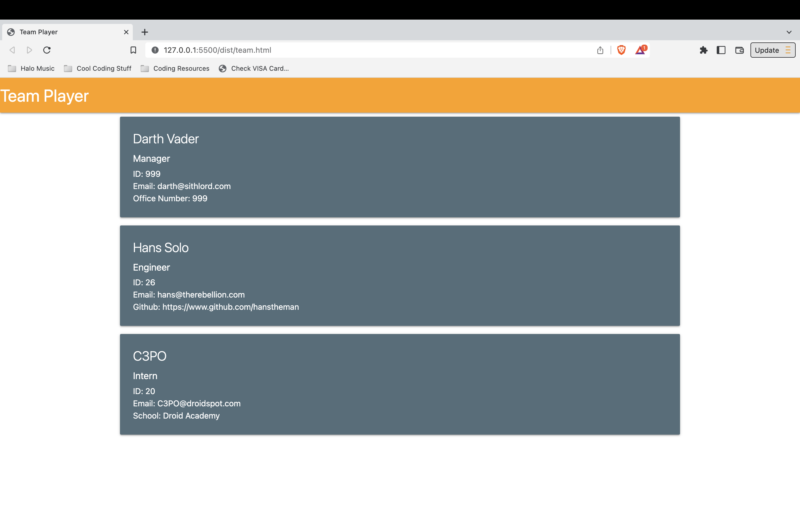

# 

# Team Player

## Description
This is a project that allows you to input team members using the command line and create an html page with all the team members organized and with all of their information displayed.

## Table of Contents
1. [Installation](#installation)
#
2. [Usage](#usage)
#
3. [License](#license)
#
4. [Contribute](#contributing)
#
5. [Tests](#tests)
#
6. [Screenshots](#screenshots)
#
7. [Questions](#questions)

(<a href="#mit-license">back to top</a>)

## Installation
To install this project, clone into the repo and then open it up in a terminal prompt. Use the command 'npm i' to install all the required packages. Now you can use 'npm start' or ' node index.js' to start building your team. From there, the command line prompts will guide you and your new html page will show up in the dist folder.

(<a href="#mit-license">back to top</a>)

## Usage
To use it, just type 'npm start' or 'node index.js' to start building your team, and when completed, the html file will show up in the dist folder.

(<a href="#mit-license">back to top</a>)

## License
[MIT License](https://opensource.org/licenses/MIT)

(<a href="#mit-license">back to top</a>)

## Contributing
Bfunk54/TeamPlayer

(<a href="#mit-license">back to top</a>)

## Tests
To test, use the usage instructions and check the html file to verify all data input is displayed on page correctly.

(<a href="#mit-license">back to top</a>)

## Screenshots

(<a href="mit-license">back to top</a>)

## Questions
Github: https://github.com/Bfunk54

Email me with any questions: ben_fein@icloud.com

(<a href="#mit-license">back to top</a>)

## Link to the site:
[Github Repo](https://github.com/Bfunk54/TeamPlayer)

(<a href="#mit-license">back to top</a>)

